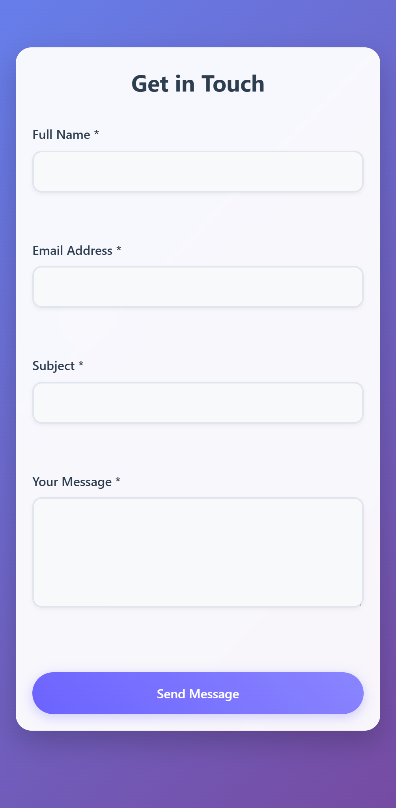

# Contact Form

A modern, responsive contact form with smooth animations and form validation.

## Features

- **Responsive Design**: Works on all device sizes
- **Form Validation**: Client-side validation for all fields
- **Modern UI**: Clean and attractive interface with smooth animations
- **Interactive Elements**: Hover and focus states for better user experience
- **Accessible**: Built with accessibility in mind
- **Bubble Animation**: Decorative animated bubbles in the background

## Technologies Used

- HTML5
- CSS3 (with animations and transitions)
- JavaScript (for form validation)

## Getting Started

1. Clone the repository:
   ```bash
   git clone [repository-url]
   ```

2. Open `index.html` in your web browser.

## Form Fields

- Full Name (required)
- Email Address (required, with email format validation)
- Subject (required)
- Message (required)

## Validation

The form includes the following validations:
- All fields are required
- Email must be in a valid format
- Minimum length requirements for name, subject, and message
- Real-time validation feedback

## Browser Support

The form is tested and works on all modern browsers including:
- Chrome (latest)
- Firefox (latest)
- Safari (latest)
- Edge (latest)

## Customization

You can easily customize the form by modifying the `styles.css` file. The color scheme and animations can be adjusted to match your brand.

## License

This project is open source and available under the [MIT License](LICENSE).

## Preview



*Note: Add a preview image of your form and save it as `preview.png` in the project root.*
